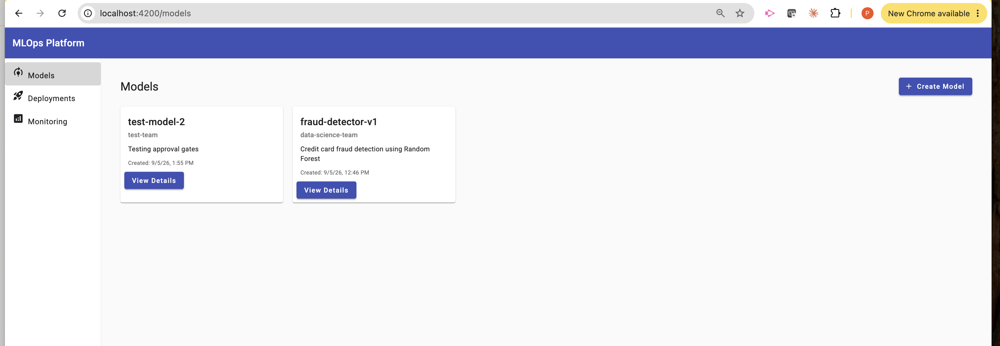
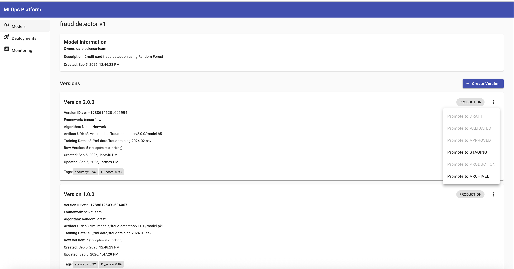
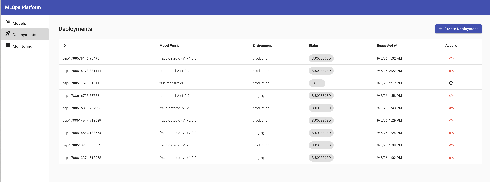
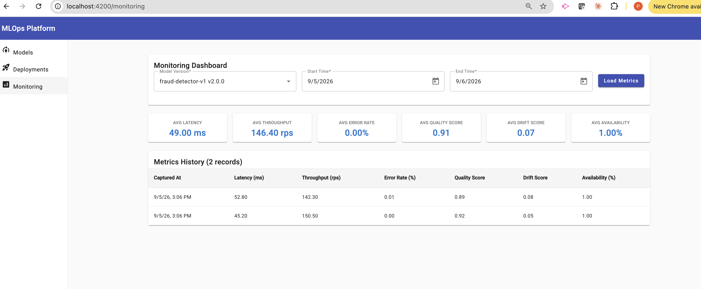
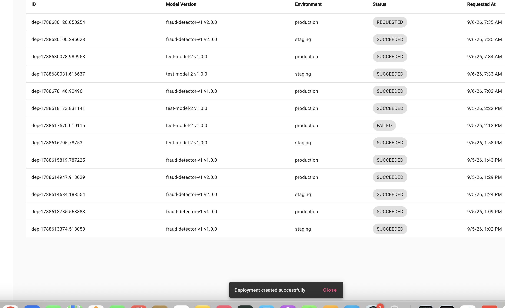

# MLOps Platform - G12 Technical Assignment

A production-grade MLOps platform built with FastAPI (backend) and Angular 17 (frontend), featuring model registry, lifecycle management, deployment orchestration, and monitoring capabilities.

## Architecture Overview

This platform implements a complete MLOps workflow:
- **Model Registry**: Version-controlled model artifacts with metadata
- **Lifecycle Management**: State machine for model progression (DRAFT → VALIDATED → APPROVED → STAGING → PRODUCTION → ARCHIVED)
- **Deployment Orchestration**: Async deployment processing with approval gates and rollback support
- **Monitoring**: Metrics collection and visualization dashboard
- **Concurrency Control**: Optimistic locking using row_version
- **Idempotency**: UUID-based keys prevent duplicate deployments

For detailed architecture, see [docs/architecture.md](docs/architecture.md)

## Technology Stack

### Backend
- **FastAPI**: Python async web framework
- **PostgreSQL**: Relational database with JSONB support
- **SQLAlchemy**: ORM with async support
- **Alembic**: Database migrations
- **Pydantic**: Data validation and serialization
- **pytest**: Testing framework

### Frontend
- **Angular 17**: Standalone components architecture
- **Angular Material**: UI component library
- **RxJS**: Reactive programming for HTTP calls
- **TypeScript**: Strict typing

### Infrastructure
- **Docker Compose**: Multi-container orchestration
- **Nginx**: Reverse proxy (optional)

## Prerequisites

- **Docker Desktop**: Version 20.10 or higher
- **Node.js**: Version 18 or higher (for local frontend development)
- **Python**: Version 3.11 or higher (for local backend development)

## Quick Start

### 1. Clone the Repository

```bash
git clone <repository-url>
cd mlops-assignment
```

### 2. Start with Docker Compose

The easiest way to run the entire platform:

```bash
docker compose up --build
```

This will start:
- PostgreSQL database on port 5432
- FastAPI backend on [http://localhost:8000](http://localhost:8000)
- Angular frontend on [http://localhost:4200](http://localhost:4200)

Access the application at [http://localhost:4200](http://localhost:4200)

### 3. Verify Backend API

Interactive API documentation (Swagger UI) is available at [http://localhost:8000/docs](http://localhost:8000/docs)

Test the health endpoint:
```bash
curl http://localhost:8000/health
```

## Development Setup

### Backend Development

1. Navigate to backend directory:
```bash
cd backend
```

2. Create virtual environment:
```bash
python -m venv .venv
source .venv/bin/activate  # On Windows: .venv\Scripts\activate
```

3. Install dependencies:
```bash
pip install -r requirements.txt
```

4. Set up environment variables:
```bash
cp .env.example .env
# Edit .env with your database credentials
```

5. Run database migrations:
```bash
alembic upgrade head
```

6. Start development server:
```bash
uvicorn app.main:app --reload --host 0.0.0.0 --port 8000
```

7. Run tests:
```bash
pytest -v
```

### Frontend Development

1. Navigate to frontend directory:
```bash
cd frontend
```

2. Install dependencies:
```bash
npm install
```

3. Start development server:
```bash
npm start
```

The frontend will be available at [http://localhost:4200](http://localhost:4200)

4. Build for production:
```bash
npm run build
```

5. Run tests:
```bash
npm test
```

## Usage Guide

### Creating a Model

1. Navigate to "Models" in the sidebar
2. Click "Create Model" button
3. Fill in:
   - Name (required, unique)
   - Owner (required)
   - Description (optional)
4. Click "Create"

### Creating a Model Version

1. From the Models list, click on a model to view details
2. Click "Create Version" button
3. Fill in:
   - Version number (e.g., "1.0.0")
   - Framework (e.g., "scikit-learn", "tensorflow")
   - Algorithm (e.g., "RandomForest", "XGBoost")
   - Artifact URI (S3 path to model binary)
   - Training data reference (S3 path to training data)
   - Tags (optional JSON, e.g., `{"accuracy": "0.95"}`)
4. Click "Create"

### Promoting Model Lifecycle

1. View a model's details page
2. Find the version you want to promote
3. Click the three-dot menu next to the version
4. Select the target lifecycle stage
5. The system enforces one-step-at-a-time progression:
   - DRAFT → VALIDATED
   - VALIDATED → APPROVED (or back to DRAFT)
   - APPROVED → STAGING (or back to VALIDATED)
   - STAGING → PRODUCTION (or back to APPROVED)
   - PRODUCTION → ARCHIVED (or back to STAGING)

### Creating a Deployment

1. Navigate to "Deployments" in the sidebar
2. Click "Create Deployment" button
3. Select:
   - Model version from dropdown
   - Environment (STAGING or PRODUCTION)
4. The system automatically:
   - Generates a UUID idempotency key
   - Validates approval gates for PRODUCTION
   - Ensures STAGING deployment before PRODUCTION (for APPROVED versions)
5. Click "Create Deployment"

### Monitoring Deployments

1. Navigate to "Deployments" page
2. View deployment status:
   - PENDING: Waiting for async worker
   - DEPLOYING: In progress
   - SUCCEEDED: Completed successfully
   - FAILED: Encountered error
3. Actions:
   - **Retry**: Available for FAILED deployments (max 3 attempts)
   - **Rollback**: Available for SUCCEEDED deployments (creates new deployment to prior version)

### Viewing Metrics

1. Navigate to "Monitoring" in the sidebar
2. Select a model version from dropdown
3. Choose date range (defaults to last 1 hour)
4. Click "Load Metrics"
5. View:
   - Summary statistics cards (averages)
   - Detailed metrics table with all data points

## API Examples

### Create a Model

```bash
curl -X POST http://localhost:8000/api/v1/models \
  -H "Content-Type: application/json" \
  -d '{
    "name": "fraud-detector",
    "owner": "data-science-team",
    "description": "Credit card fraud detection model"
  }'
```

### Create a Version

```bash
curl -X POST http://localhost:8000/api/v1/models/{model_id}/versions \
  -H "Content-Type: application/json" \
  -d '{
    "version_number": "1.0.0",
    "framework": "scikit-learn",
    "algorithm": "RandomForest",
    "artifact_uri": "s3://models/fraud-detector/v1.0.0",
    "training_data_ref": "s3://data/fraud-training-2024",
    "tags": {"accuracy": "0.95", "f1_score": "0.93"}
  }'
```

### Promote Lifecycle

```bash
curl -X PATCH http://localhost:8000/api/v1/versions/{version_id}/lifecycle \
  -H "Content-Type: application/json" \
  -d '{
    "target_stage": "VALIDATED",
    "row_version": 1
  }'
```

### Create Deployment

```bash
curl -X POST http://localhost:8000/api/v1/deployments \
  -H "Content-Type: application/json" \
  -d '{
    "model_version_id": "{version_id}",
    "environment": "STAGING",
    "idempotency_key": "unique-uuid-here"
  }'
```

### Ingest Metrics

```bash
curl -X POST http://localhost:8000/api/v1/metrics \
  -H "Content-Type: application/json" \
  -d '{
    "model_version_id": "{version_id}",
    "latency_ms": 45.2,
    "throughput_rps": 120.5,
    "error_rate": 0.01,
    "quality_score": 0.95,
    "drift_score": 0.02,
    "availability": 99.9
  }'
```

## Testing

### Run All Backend Tests

```bash
cd backend
pytest -v
```

### Run Specific Test Categories

```bash
# Unit tests only
pytest tests/unit/ -v

# Integration tests only
pytest tests/integration/ -v

# Lifecycle tests
pytest tests/unit/test_lifecycle_transitions.py -v

# Optimistic locking tests
pytest tests/unit/test_optimistic_locking.py -v
```

### Test Coverage

```bash
pytest --cov=app --cov-report=html
# View coverage report at htmlcov/index.html
```

## Key Features

### 1. Optimistic Locking

Prevents concurrent update conflicts using `row_version` field:
- Each update increments `row_version`
- Clients must provide current `row_version` when updating
- Stale `row_version` triggers conflict error
- Clients can retry with fresh version

See [ADR-004](docs/adr/004-optimistic-locking.md) for details.

### 2. Idempotency

UUID-based idempotency keys prevent duplicate deployments:
- Each deployment requires unique `idempotency_key`
- Database unique constraint enforces idempotency
- Rollback auto-generates key: `rollback-{deployment_id}`
- Retry preserves original key

### 3. Lifecycle State Machine

Enforces one-step-at-a-time promotion:
- Prevents skipping stages (e.g., DRAFT directly to PRODUCTION)
- Allows rollback transitions (e.g., VALIDATED back to DRAFT)
- ARCHIVED is terminal state (no transitions out)

### 4. Approval Gates

PRODUCTION deployments require:
- Version in APPROVED, STAGING, or PRODUCTION lifecycle stage
- For APPROVED versions: prior successful STAGING deployment

### 5. Async Deployment Processing

Background worker processes deployments:
- `FOR UPDATE SKIP LOCKED` for concurrent worker support
- Max 3 retry attempts for failed deployments
- Simulated deployment delay (5 seconds in worker)

## Project Structure

```
mlops-assignment/
├── backend/
│   ├── alembic/              # Database migrations
│   ├── app/
│   │   ├── api/              # REST API endpoints
│   │   ├── models/           # SQLAlchemy models
│   │   ├── repositories/     # Data access layer
│   │   ├── schemas/          # Pydantic schemas
│   │   ├── services/         # Business logic
│   │   ├── worker/           # Async deployment worker
│   │   ├── database.py       # Database connection
│   │   └── main.py           # FastAPI application
│   ├── tests/
│   │   ├── unit/             # Unit tests
│   │   └── integration/      # Integration tests
│   ├── Dockerfile
│   └── requirements.txt
├── frontend/
│   ├── src/
│   │   ├── app/
│   │   │   ├── components/   # Angular components
│   │   │   ├── models/       # TypeScript interfaces
│   │   │   ├── services/     # HTTP services
│   │   │   └── app.routes.ts
│   │   └── environments/
│   ├── Dockerfile
│   └── package.json
├── docs/
│   ├── architecture.md       # System architecture
│   ├── adr/                  # Architecture Decision Records
│   ├── test-strategy.md      # Testing approach
│   ├── leadership-qna.md     # G12 leadership questions
│   └── delivery-plan.md      # Team delivery plan
├── docker-compose.yml
└── README.md
```

## Screenshots

### Models List

*Model registry showing registered models with create button*

### Model Detail

*Model detail view showing versions, lifecycle stages, and version ID*

### Deployments List

*Deployment tracking with user-friendly version names, status, and action buttons*

### Monitoring Dashboard

*Metrics dashboard showing performance metrics over time*

### Create Deployment Dialog

*Deployment creation dialog with validation*

## Known Limitations

### Current Implementation

1. **Simulated Deployment Target**
   - Worker simulates deployment execution with 5-second delay
   - No actual Kubernetes/cloud provider integration
   - Production implementation would require `DeploymentTarget` adapter for real infrastructure

2. **In-Process Worker**
   - Worker runs in same process as FastAPI app
   - Not resilient to application restarts
   - Production would require Celery/Redis for restart durability
   - See [ADR-003](docs/adr/003-worker-model.md)

3. **No Authentication/Authorization**
   - All endpoints publicly accessible
   - No user context or role-based access control
   - Production requires JWT + role claims on approval/deploy endpoints
   - See [architecture.md Security section](docs/architecture.md)

4. **Limited Validation Rules**
   - Artifact URI format not validated (accepts any string)
   - No actual S3 connectivity checks
   - Version number format not strictly enforced

5. **Metric Partitioning Not Active**
   - Weekly partitioning strategy designed but not implemented
   - Would be required before high-volume production use
   - See [architecture.md Partitioning Strategy](docs/architecture.md)

6. **No Multi-Tenancy**
   - Single-tenant design
   - Production multi-tenant would require `tenant_id` scoping
   - See [leadership-qna.md Q5](docs/leadership-qna.md)

7. **Basic Error Recovery**
   - Deployment retry cap is 3 attempts
   - No exponential backoff on retries
   - No dead-letter queue for permanently failed deployments

8. **Frontend Polling**
   - Deployment status updates via 5-second polling
   - WebSocket/SSE would be more efficient for real-time updates

### Intentional Scope Boundaries

These are **not** bugs but deliberate scope decisions for the G12 timeframe:

- No A/B testing or canary deployment support
- No model performance comparison views
- No automated rollback on metric threshold violations
- No drift-triggered alerts (dashboard-only visibility)
- No audit log export functionality
- No model artifact storage (only URI references)

## Future Improvements

### Near-Term Enhancements

1. **Authentication & Authorization**
   - Implement JWT-based authentication
   - Add role-based access control (Admin, DataScientist, Viewer)
   - Enforce server-side permissions on approval/deploy endpoints
   - See [architecture.md Security](docs/architecture.md)

2. **Production Worker Migration**
   - Replace in-process poller with Celery + Redis
   - Add restart durability for in-flight deployments
   - Implement exponential backoff on retries
   - See [ADR-003](docs/adr/003-worker-model.md)

3. **Real Deployment Targets**
   - Implement Kubernetes adapter for `DeploymentTarget` interface
   - Support multiple cloud providers (AWS SageMaker, Azure ML, GCP Vertex AI)
   - Add health check probes for deployed models

4. **Multi-Tenancy Support**
   - Add `tenant_id` to all tables
   - Scope all queries by tenant
   - Add tenant-level quotas and rate limits
   - See [leadership-qna.md Q5](docs/leadership-qna.md)

5. **Drift-Triggered Alerts**
   - Automated notifications when `drift_score` exceeds threshold
   - Integration with Slack/PagerDuty/email
   - Configurable alert rules per model

### Long-Term Vision

6. **A/B Testing & Canary Deployments**
   - Traffic splitting between model versions
   - Automatic rollback on quality degradation
   - Champion-challenger evaluation framework

7. **Model Explainability**
   - SHAP/LIME integration for prediction explanations
   - Feature importance tracking over time
   - Bias detection and fairness metrics

8. **Advanced Monitoring**
   - Real-time WebSocket updates instead of polling
   - Custom metric definitions per model
   - Anomaly detection on metric trends
   - Automated performance regression alerts

9. **MLOps Workflow Automation**
   - CI/CD integration for model deployment
   - Automated retraining pipelines
   - Model comparison and selection workflows

10. **Enhanced Security**
    - Audit log export to SIEM systems
    - Secrets management via HashiCorp Vault
    - Network policies and service mesh integration
    - Model artifact signing and verification

## Documentation

- [Architecture Overview](docs/architecture.md)
- [Test Strategy](docs/test-strategy.md)
- [Leadership Q&A](docs/leadership-qna.md)
- [Delivery Plan](docs/delivery-plan.md)
- [Risk Register](docs/risk-register.md)
- [Known Limitations](docs/known-limitations.md)
- [Roadmap](docs/roadmap.md)

### Architecture Decision Records (ADRs)

- [ADR-001: Async Deployment Processing](docs/adr/001-async-deployment-processing.md)
- [ADR-002: PostgreSQL Database](docs/adr/002-postgresql.md)
- [ADR-003: In-Process Worker Model](docs/adr/003-worker-model.md)
- [ADR-004: Optimistic Locking](docs/adr/004-optimistic-locking.md)

## Troubleshooting

### Backend Issues

**Database connection error:**
```bash
# Check if PostgreSQL is running
docker compose ps

# View backend logs
docker compose logs backend

# Restart services
docker compose restart backend
```

**Migration issues:**
```bash
# Reset database (WARNING: deletes all data)
docker compose down -v
docker compose up -d db
cd backend
alembic downgrade base
alembic upgrade head
```

### Frontend Issues

**Build errors:**
```bash
# Clear node_modules and reinstall
cd frontend
rm -rf node_modules package-lock.json
npm install
```

**Port already in use:**
```bash
# Change port in docker-compose.yml or kill process
lsof -ti:4200 | xargs kill -9
```

### Docker Issues

**Port conflicts:**
```bash
# Stop all containers
docker compose down

# Check what's using the port
lsof -i :8000  # or :4200, :5432
```

**Out of disk space:**
```bash
# Clean up Docker resources
docker system prune -a --volumes
```

## Performance Considerations

- Database connection pooling configured in SQLAlchemy
- Cursor-based pagination for large result sets
- Background worker uses row-level locking for concurrency
- Frontend uses lazy loading for routes (if configured)
- Angular Material virtual scrolling for large tables (if needed)

## Security Considerations

- API endpoints validate all input using Pydantic
- SQL injection prevented by SQLAlchemy ORM
- CORS configured for frontend origin
- Secrets managed via environment variables
- Database credentials not committed to repository

## Contributing

1. Create feature branch from `main`
2. Implement changes with tests
3. Run full test suite
4. Submit pull request with description

## License

This is a technical assignment submission.

## Contact

For questions or issues, please contact the project maintainer.
